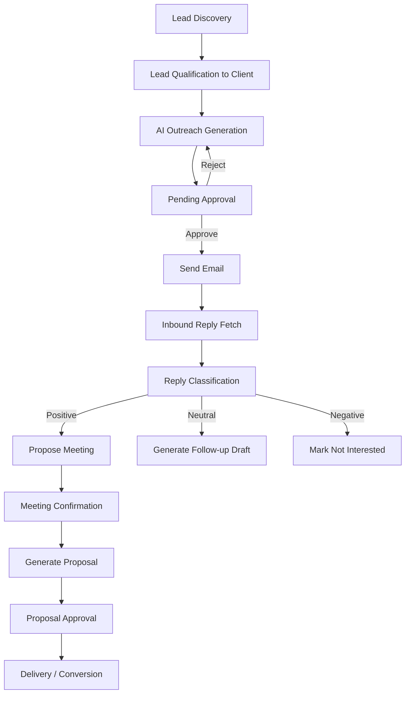

# Agency Workflow Automation - Supplementary Implementation Report

## 1. Purpose of this Supplement

This document supplements the Capstone Project-II report by aligning the report narrative with the current, working implementation in the repository. It captures:

- What is implemented today in the real project
- Where implementation differs from the original ideation text
- End-to-end workflow across all major modules
- Figure descriptions for the screenshot list (Fig. 5.1 to Fig. 5.10)
- Updated citations and references

## 2. Key Updates from Original Ideation to Real Implementation

### 2.1 Technology Stack: planned vs implemented

Implemented now:

- Backend: Flask, Flask-SQLAlchemy, Flask-Migrate
- Auth: Flask-Login with hashed passwords
- AI model provider: Google Gemini (generation + embeddings)
- Retrieval layer: local FAISS index on disk
- Scheduler: APScheduler background jobs
- Email: Gmail SMTP and IMAP
- Calendar: Google Calendar API
- Notifications: Slack Webhook + in-app notification model
- Database: SQLite (default), migration-ready architecture

Important difference from earlier report text:

- The current codebase uses local FAISS and SQLite by default, not Supabase pgvector as the active runtime path.
- LLM model usage is Gemini-centric in current code.

### 2.2 Workflow maturity updates

Implemented and operational:

- Human-in-the-loop approvals for emails and proposals
- AI lead discovery and lead-to-client qualification path
- Outreach generation with RAG context enrichment
- Reply fetching/classification and action triggering
- Meeting proposal and confirmation with calendar integration
- Proposal/report generation and filesystem persistence
- System-wide activity logging and approval notifications

## 3. Real System Architecture (as implemented)

## 3.1 High-level architecture

1. Presentation Layer

- Jinja templates + custom CSS/JS
- Dashboard, discovery, clients, emails, replies, meetings, documents, auth

2. Application Layer

- Flask blueprints for route separation
- API endpoints for automation and integrations

3. Service Layer

- Email service, reply classifier, scheduler service, document service, discovery service, RAG service, notification service, slack service

4. Data Layer

- SQLAlchemy models for core entities
- FAISS vector index + metadata store for semantic retrieval
- Output storage for generated proposals/reports and uploaded docs

5. Integration Layer

- Gemini API, Gmail SMTP/IMAP, Google Calendar API, Slack Webhooks

## 3.2 Runtime workflow map

## 4. Module-by-Module Functional Scan

### 4.1 Authentication and access control

- User signup/login/logout implemented with validation.
- Password hashing is applied before persistence.
- Global request guard enforces login for protected routes.

### 4.2 Dashboard and monitoring

- Displays operational KPIs: sent emails, replies, meetings, documents.
- Shows pipeline distribution by client status.
- Includes pending approvals and recent activity timeline.

### 4.3 Lead discovery

- AI generates candidate leads for a chosen domain.
- ICP score and reasoning are generated.
- Leads can be promoted to clients in one step.

### 4.4 Client management

- CRUD-like operations (add, view, update; soft archive).
- Client profile stores preferences and notes for personalization.
- New clients are indexed into RAG memory immediately.

### 4.5 Email automation and approval

- Outreach/follow-up drafts are generated by Gemini with RAG context.
- Drafts are stored as pending approval.
- Approval triggers SMTP send; rejection returns draft state.
- Sending updates client status and logs interactions.

### 4.6 Reply ingestion and action orchestration

- IMAP fetches unread messages.
- AI classification path targets POSITIVE/NEUTRAL/NEGATIVE.
- Extracted entities are persisted.
- Automated next actions:
  - Positive -> meeting proposal
  - Neutral -> follow-up draft generation
  - Negative -> mark not interested

### 4.7 Meeting scheduling

- Proposes three candidate slots from Google Calendar availability.
- Supports confirmation flow and event creation.
- On confirmation, proposal generation is triggered automatically.

### 4.8 Document generation and management

- Proposal and report generation via Gemini + RAG context.
- Outputs are saved as markdown files under outputs/.
- Document approval workflow is implemented.
- Upload flow supports txt/pdf/doc/docx/md/html with safe naming.

### 4.9 Notifications and human-in-the-loop controls

- In-app notifications table and APIs for unread/all/read/count.
- Slack messages for approval-required events.
- Approval URLs are generated for quick operator action.

### 4.10 Scheduler and background automation

- Job 1: fetch/classify replies every 15 minutes.
- Job 2: daily follow-up check for stale outreach clients.

### 4.11 RAG and memory layer

- Uses Gemini embeddings for chunk vectors.
- Uses FAISS IndexFlatL2 for similarity retrieval.
- Stores chunk metadata and persists index to data/faiss_index.
- Supports full bootstrap indexing from existing records.

## 5. Data Model Summary

Core entities:

- User: credentials and account metadata
- Lead: discovered prospect + ICP scoring
- Client: canonical business contact profile and lifecycle status
- EmailRecord: generated/sent email state machine
- InboundReply: classified incoming email and extracted entities
- Meeting: proposed/confirmed scheduling state
- Document: generated or uploaded artifacts with status
- Notification: in-app action alerts
- InteractionLog: audit and timeline trail
- RAGDocument: source text and vector chunk mapping

## 6. Figure Descriptions (for report screenshots)

Note: The repository does not include image files for these screenshots. The descriptions below can be used as standardized captions and explanatory text under each figure in the final report/PDF.

### Fig. 5.1 Dashboard Overview

Description:
The dashboard presents daily operational KPIs (emails sent, replies received, meetings this week, and generated documents), client pipeline distribution across lifecycle stages, recent activity feed, and pending approval cards for emails/proposals. This page is the central control surface for operators.

### Fig. 5.2 AI Lead Prospector

Description:
The lead discovery screen allows users to input an industry/domain and trigger AI-powered prospect discovery. Each card shows company details, an ICP fit score, rationale, and a one-click qualify action to convert a lead into a managed client record.

### Fig. 5.3 Client Management Overview

Description:
The client directory lists all clients with status filters, key profile fields, and quick actions. It provides lifecycle visibility and direct navigation into detailed client-level workflows.

### Fig. 5.4 Email Management Overview

Description:
The email ledger displays generated outreach/follow-up emails with status badges (pending approval/sent/failed), timestamps, and client mapping. It supports operational review of messaging pipeline throughput.

### Fig. 5.5 Replies Inbound Clarifications

Description:
The replies view shows processed inbound emails with AI classification labels, extracted entities (dates/companies/requirements), and triggered actions. This screen reflects the NLP-based decision branch for next-step automation.

### Fig. 5.6 Meetings Directory

Description:
The meetings page tracks proposed and confirmed meetings, agenda summaries, chosen slots, and current status. It supports review, confirmation, cancellation, and historical scheduling audit.

### Fig. 5.7 Documents Management

Description:
The documents ledger lists generated/uploaded documents by type and status, with links to detailed previews and actions. It enables review/approval and download of proposal/report artifacts.

### Fig. 5.8 Client Profile Management

Description:
The client detail interface consolidates profile data, editable preferences/notes, communication records, and timeline logs. It also exposes direct workflow triggers (generate outreach, proposal, schedule meeting, upload document).

### Fig. 5.9 Meeting Setup

Description:
The meeting creation form captures client selection, agenda, and optional proposed slots in ISO datetime format. This forms the entry point to human-approved scheduling workflows.

### Fig. 5.10 Email Composition

Description:
The email detail/composer page presents recipient metadata, editable subject/body, approval actions, and send-state metadata. It enforces human approval before external dispatch in normal workflow.

## 7. Functional and Non-Functional Coverage Status

### 7.1 Functional coverage

Implemented:

- User authentication
- Client data management
- AI outreach generation + approval + send
- Reply fetch/classify + triggered next actions
- Meeting proposal/confirmation
- Proposal/report generation + upload/download
- Notification subsystem (Slack + in-app)
- RAG context retrieval and indexing
- Dashboard metrics and timeline logs

Partially implemented or planned next:

- Full role-based permission matrix (currently basic auth gating)
- Advanced analytics dashboards and conversion intelligence
- Multi-channel outreach beyond email

### 7.2 Non-functional coverage

Current strengths:

- Modular service-oriented code organization
- Recoverable defaults/fallbacks in several integrations
- Background scheduling support
- Persistent audit-style interaction logging

Known limitations to document transparently:

- SQLite default limits production concurrency scale
- Secrets are env-based; enterprise secret manager integration is not yet included
- Compliance hardening (e.g., SOC2 controls) remains a deployment-stage responsibility
- Some AI/integration flows need stronger error-path testing and CI test automation

## 8. Suggested Corrected Wording for Final Report Chapters

1. Replace any statement claiming active Supabase/pgvector runtime with: local FAISS + SQLite default, with migration path to PostgreSQL.
2. Replace provider-agnostic AI claims with explicit note that current implementation is Gemini-based.
3. Keep Human-in-the-Loop as a core design claim; it is concretely implemented for email/proposal approval.
4. Clarify that screenshots are prototype/working UI captures and should include caption text from Section 6.

## 9. Citation and Reference List

Use numeric in-text citation style [1]-[10].

[1] Lewis, P., Perez, E., Piktus, A., Petroni, F., Karpukhin, V., Goyal, N., Kuttler, H., Lewis, M., Yih, W., Rocktaschel, T., Riedel, S., and Kiela, D. (2020). Retrieval-Augmented Generation for Knowledge-Intensive NLP Tasks. arXiv:2005.11401. https://arxiv.org/abs/2005.11401

[2] LangChain Documentation (2024). Build a Retrieval Augmented Generation (RAG) App. https://python.langchain.com/docs/tutorials/rag/

[3] Google Generative AI for Python - API Documentation (Gemini models and embeddings). https://ai.google.dev/

[4] FAISS Documentation (Facebook AI Similarity Search). https://faiss.ai/

[5] Flask Documentation (Application architecture and routing). https://flask.palletsprojects.com/

[6] SQLAlchemy Documentation (ORM and persistence patterns). https://docs.sqlalchemy.org/

[7] APScheduler Documentation (Background scheduling in Python). https://apscheduler.readthedocs.io/

[8] Google Calendar API Documentation. https://developers.google.com/calendar/api

[9] Python standard libraries documentation for SMTP/IMAP email integration. https://docs.python.org/3/library/

[10] Project implementation source code and templates in this repository (Agency Workflow Automation, main branch).

## 10. Appendix: Repository Evidence Mapping

Primary evidence locations used for this supplement:

- README and setup/runtime docs
- app/routes/\* for HTTP workflow
- app/services/\* for automation, AI, and integration logic
- app/models/\* for schema and lifecycle fields
- scheduler.py and run.py for automation runtime
- app/templates/\* for UI behavior reflected in screenshot captions
- requirements.txt for dependency verification

---

Prepared as an implementation-aligned supplement to the Capstone Project-II report for Agency Workflow Automation.
